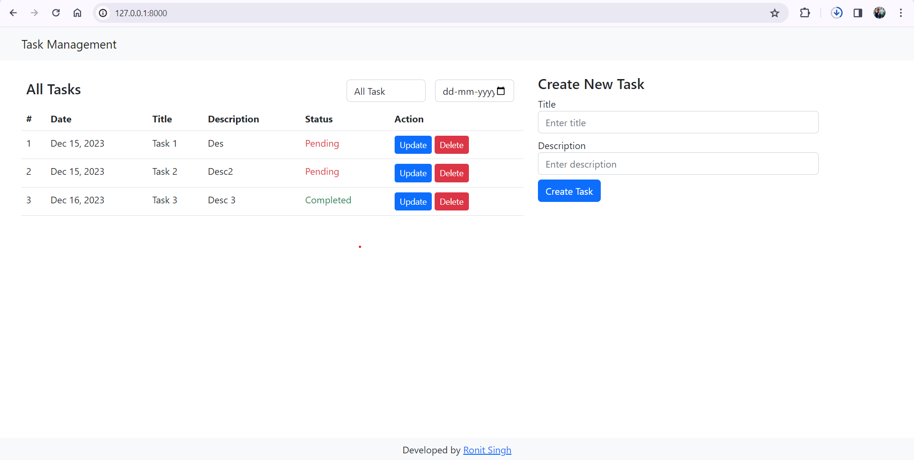
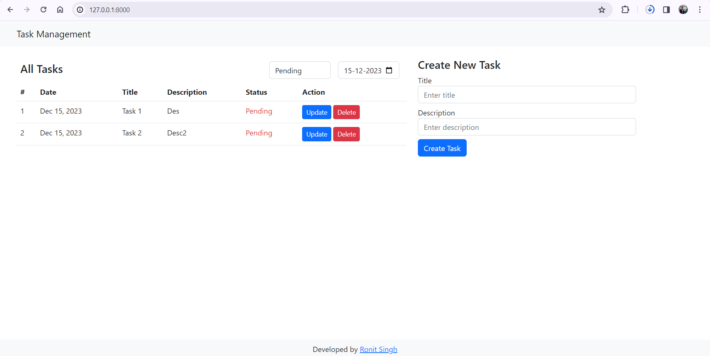
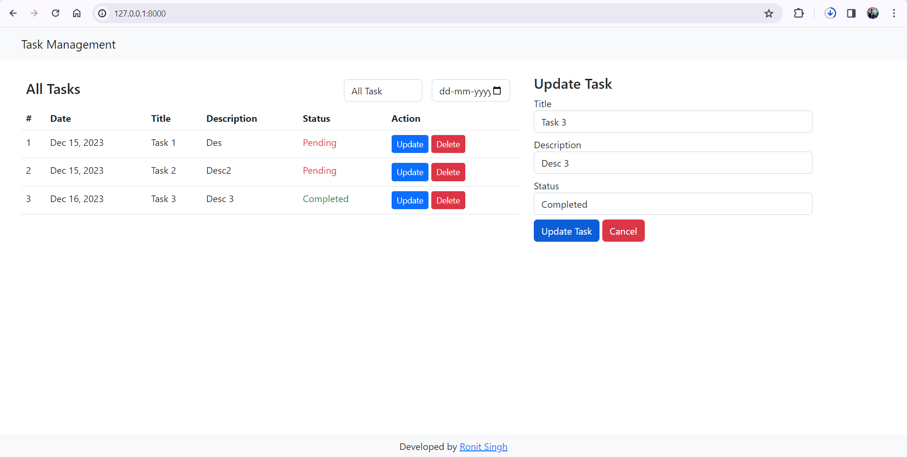
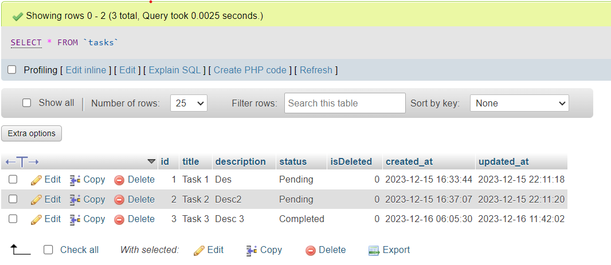

# Task Management System (Laravel)


> By Ronit Singh, Web Team Lead at [Nextgen Techno Ventures Pvt Ltd](https://nextgentechno.in/)

## Features
- Task Creation
- Show Task
- Update Task
- Delete Task
- Filter Task by Status and Date

## How to run the project
- #### #1 Clone the project 
     ```git clone https://github.com/imronit2001/task-management.git```
- #### #2 Install Dependencies 
     ```composer install```
- #### #3 Create Environment File 
    ```cp .env.example .env``` [For Bash Shell]
    ```copy .env.example .env``` [For DOS Shell]
- #### #4 Set the Key
     ```php artisan key:generate```
- #### #5 Create New Datatabase from PHPmyadmin
- #### #6 Update the Database Name in .env file
- #### #7 Run the Migration
    ```php artisan migrate```
- #### #7 Run the Project
    ```php artisan serve```

## Screenshots





